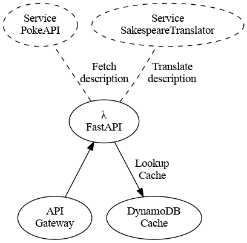

# Poke-Bard

### OpenAPI

You can access the interactive documentation using Swagger UI at:

https://8qumbw8k6h.execute-api.eu-west-1.amazonaws.com/dev

Using the API you can test queries using the browser.

The API is deployed in AWS.

### Example

Usage example (using httpie):

`http https://8qumbw8k6h.execute-api.eu-west-1.amazonaws.com/dev/pokemon/charizard`

Output format:

``` json
{
    "name": "charizard",
    "description": "Charizard flies 'round the sky in search of powerful opponents. 't breathes fire of such most wondrous heat yond 't melts aught. However, 't nev'r turns its fiery breath on any opponent weaker than itself."
}
```

## Design and implementation

It is a Serverless API using FastAPI/Magnum on top of AWS' Lambda, DynamoDB,
and API Gateway.



## Development tools

The included Makefile abstracts the common development, testing, packaging, and
deploying steps:

- Includes `help` target (default) with usage information.
- Verifies dev environment for missing configuration.
- Builds the compiled zip artefact. Upload zip artefact to S3. Deploys.
- Builds and deployment artefacts are kept in S3 for archive and rollback.
- `tdd`, `debug`, `run`, `test`, `coverage`: and more, to help debugging, and
  integration with CI/CD pipelines.
- `docker-build`, and `docker-run`: to build and/or run dockerized.


## Architecture

It's uploading the "compiled" code to S3 instead of directly as a Lambda
Function to allow flexibility, and it is ready to split the dependencies into
layers, but I find it an unnecessary complexity for this project.

Using SAM to keep it simple. It has the same capabilities as full-fledged
CloudFormation, but it's better suited for Serverless applications.
The CloudFormation Template includes custom policies to keep it with minimal
privileges required to run.

FastAPI is a very fast and elegant API Framework that offers OpenAPI
documentation, and good parallel processing support. It runs on top of Mangum
library, which serves as a wrapper for ASGI APIs running inside of AWS Lambda
and API Gateway. It provides an adapter, which:

- routes requests made to the API Gateway to our Lambda function
- routes Lambda function responses back to the API Gateway

It is logging to CloudWatch, and reporting metrics to Datadog.

### Why is this architecture attractive?

For an API of very sporadic use, having a completely serverless API
infrastructure has many benefits:

- no upfront cost (it'll serve 1 million invocations per month for free)
- unlimited scalability (lambda functions and dynamodb, can scale up quickly)
- standard OpenAPI interactive documentation for free (as long as the code is
  well formatted)
- if required API Gateway caching can be enabled
- authentication, and authorization is trivial using Cognito (and allows third
  party auth providers like Google or Facebook)

 ready for rollbacks.")


## Development Environment Setup

### Install Python


### Set Python Environment

Install [virtualenvwrapper](https://virtualenvwrapper.readthedocs.io/en/latest/install.html),
or any other environment manager.

TL;DR:
```
pip install virtualenvwrapper
echo -e '\n# Set the WORKON_HOME variable for virtualenvwrapper \nexport WORKON_HOME="~/.virtualenvs"' >> ~/.bash_profile && echo -e '\n# Source the virtualenvwrapper shell script to be able to run commands \nsource /usr/local/bin/virtualenvwrapper.sh' >> ~/.bash_profile && source ~/.bash_profile
```

Create a development environment:

```
mkvirtualenv poke-bard
```

### Set Environment variables

If you try to run any target, make will complain asking your to `source .env`.
This is my development environment file.

``` sh
export STAGE="dev"
export ARTEFACTS_BUCKET="bard-apis"
export CACHE_TABLE="pokebard-dev-cache"
export DUMMY="true"
```

The purpose of allowing environment variables to define the scripts' behavior
is to ready the creation of CD/CI pipelines.

I have experience using this approach with Jenkins, Gitlab, and CircleCI.

### Test Code

If all is setup you should be able to run the tests.

```
make coverage
```

It will take longer the first time since it has to install dependencies, but it
should be faster from now on.

# Dockerfile

Creating a dockerfile for fastapi is trivial. I did created it since it's
suggested as part of the exercise, but I think simple lambdas are good enough
to deploy an experimental API that might be used only once.


# Cache

Using a lookup table based on DynamoDB.  This approach offers longer TTL (the
limit with API Gateway's build-in one is 3600 seconds).  Why not ElasticCache
with Redis? Just because the winnings of having the cache in a full-fledged
on-memory storage are beyond the requirements of this application.  This
approach is free; and has minimal latency.

# Missing

With more time I would:
- write some tests for `dynamodb_cache` module, it is the only file with less
  than 100% coverage
- as second iteration I would adjust architecture to usage patterns (datadog
  metrics are crucial for this)
